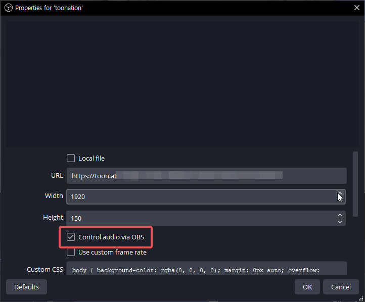
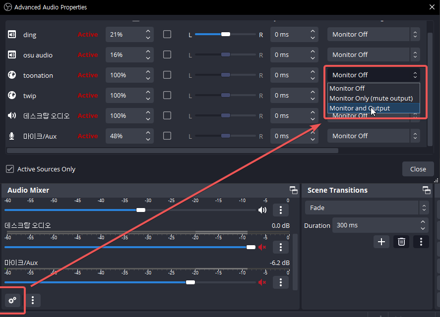

OBS Studio 28버전부터 추가된 [응용 프로그램 오디오 캡쳐](https://obsproject.com/kb/application-audio-capture-guide)가 생긴 후로 데스크탑 오디오를 아예 끄고 방송을 여태까지 하고 있다.\
비록 설정하는건 귀찮고 복잡하지만, 디코 전화 등 다른 오디오들을 송출을 안해주니까 매우 좋다.

다만 트윕/투네이션 같은 브라우저 알림을 쓰는 스트리머들은 그냥 사용시 나만 들리고 송출이 안되는데, 이를 해결하는 방법이 있다.

---

우선 브라우저 소스 속성에 가서 `OBS를 통해 오디오 조절`을 체크해준다.

오디오 믹서 좌측 하단 톱니바퀴 아이콘을 클릭하고, **오디오 모니터링에서 `모니터링과 출력`으로 설정**해준다.

---

이제 나도 들리고 방송에도 들린다. 만세!
