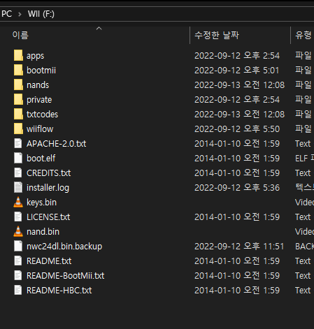
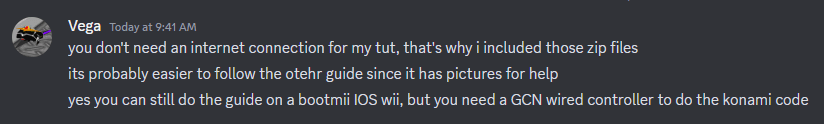
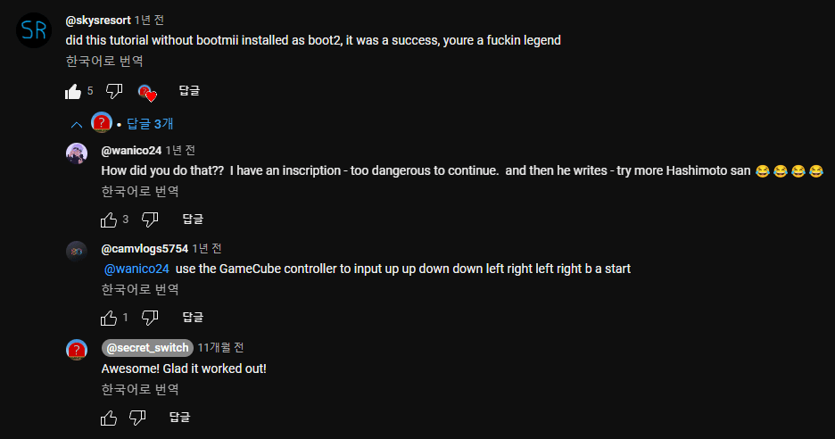
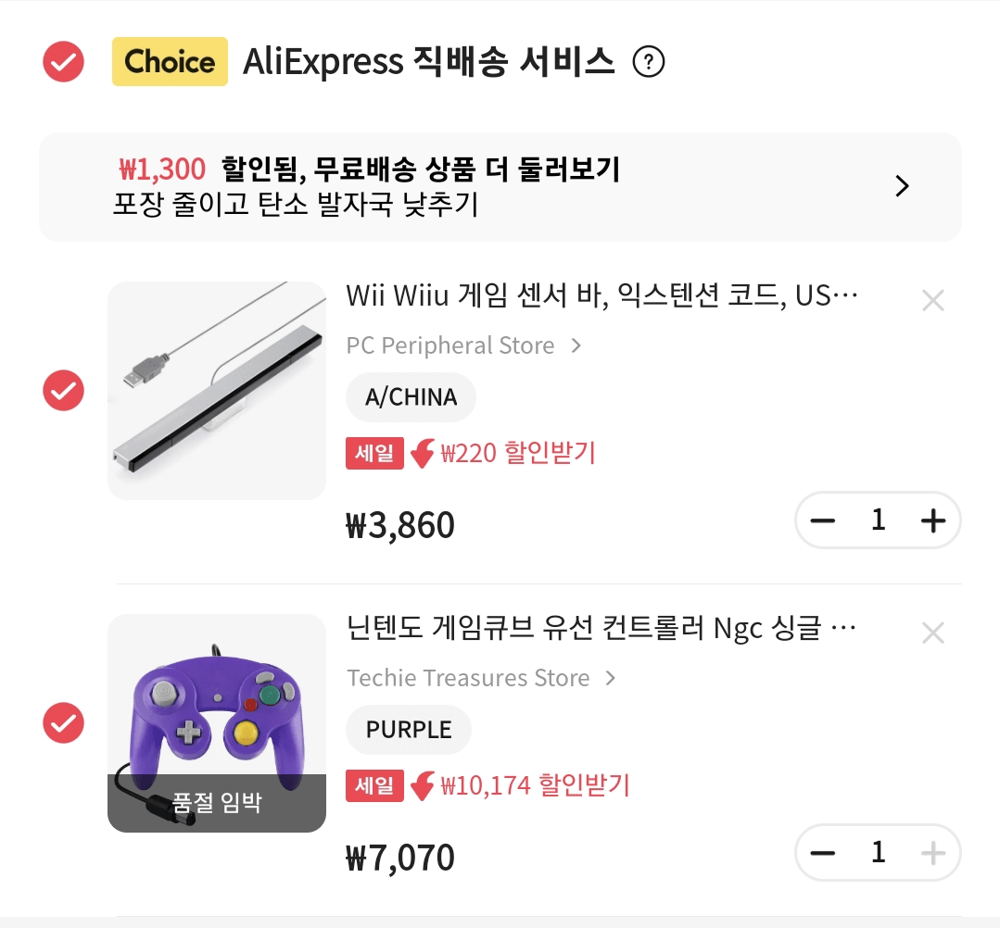

## 들어가기에 앞서
영어를 잘하거나 아니면 번역기를 돌려도 이해를 할 수 있는 정도면 이 포스팅을 안봐도 된다.
왜냐면 [wii.guide](https://wii.hacks.guide)을 기준으로 작성된거라..

2014년 어렸을때 이미 모딩을 한적이 있는데, 잘못 건들었는지 2022년에 다시 모딩을 해도 제대로 작동하지를 않는다.
> 
> 벌써 10년전이라고?

그래서 **다시 순정 Wii로 되돌리고** 모딩을 하려고 한다.

## 검색
순정으로 되돌리기 위해 튜토리얼이 있는지 구글에 검색을 하였다.

[유튜브 1](https://www.youtube.com/watch?v=gD-MWXdA8EI) [유튜브 2](https://www.youtube.com/watch?v=jdBjbOtwJGo) [레딧](https://www.reddit.com/r/WiiHacks/comments/tbzky7/wii_homebrew_guide_modded_to_stock_read_premises/) [wii.guide](https://wii.hacks.guide/wii-factory-reset.html) [mariokartwii.com](https://mariokartwii.com/showthread.php?tid=877)

대충 백업된 NAND 파일을 Ohneschwanzenegger 프로그램을 이용해 순정으로 바꿔놓고 복원하는 작업을 하라는데, **상당히 위험한 작업이라고 한다.**\
이유는 BootMii이 IOS에만 깔려있으면 복원하다 잘못될시 **영원히 복돌상태로 남는다고 한다!** [^1]

초기 Wii엔 boot2에 취약점이 있어 BootMii 설치가 가능해 벽돌이 나도 안전하게 복구가 가능하지만 후기 Wii(한국판 포함)엔 막혀서 IOS만 설치가 가능하다고 하는데.. *알빤가?*\
벽돌시 NAND만 잘 백업된다면 Dolphin 에뮬에서 돌리면 그만이긴 하다, 중고에 아직 매물이 있기도 하고.

## 궁금증
그래도 쫄리니 최대한 지금 궁금한 것들을 풀고 진행하려고 한다.

우선 mariokartwii에는 다른 튜토리얼과 달리 따로 준비된 순정 NAND 패키지 파일로 진행하는데, 차이점이 있는지 직접 물어보았다.

그저 인터넷 필요 없이 가능한 튜토리얼인걸로! 추가적으로 더 물어보려 했으나 모딩에서 손 놓으신지 많이 오래되셔서 여기까지 물어보았다.

다음은 복원이 제대로 되는가이다, BootMii on IOS에서 복원하면 스스로 덮어쓴다는(!) [포럼 댓글](https://forum.wiibrew.org/read.php?25,44256,50092)을 찾은지라 BootMii이 없는 순정 NAND를 복원시키면 혹시라도 실패하는가 하는 생각이 들었다.

헛된 생각이였고 IOS에서 사례가 딱 하나 있어서 진행하기로 했다. 고마워요 대신맨!

## 문제
NAND 복원하려면 게임큐브 컨트롤러로 코나미 코드를 입력해야 된다고 한다(...)

그래서 샀다. ~~혹시 고장나면 에뮬로 해야니까 USB 센서바도 샀다~~

3주정도 걸린다고 하니 그때동안 예습(?)을 해야겠다.

[^1]: 자세하기 말하기 힘들지만 [sd_boot](https://wiki.raregamingdump.ca/index.php/Wii_Boot_Process#boot2) 관련 개발이 많이 이루어지면 복구 가능성이 없지 않다고 한다.