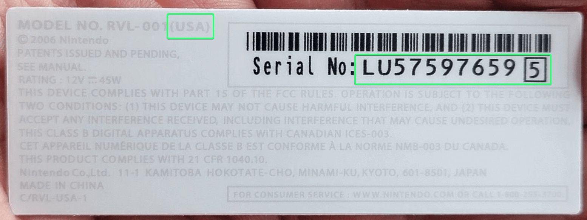
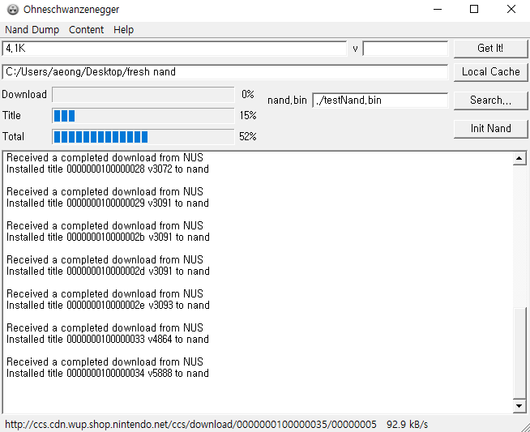
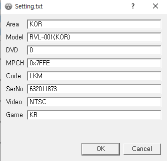
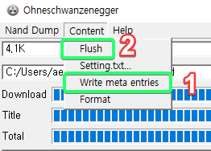
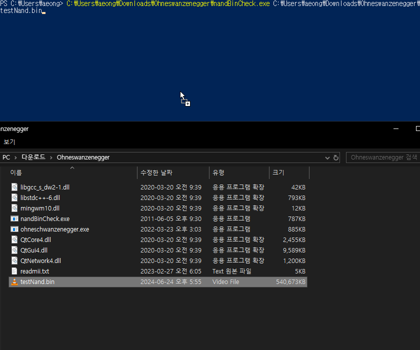
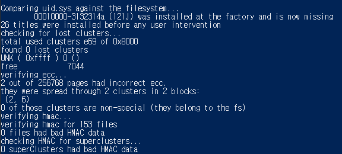
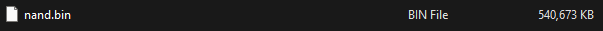
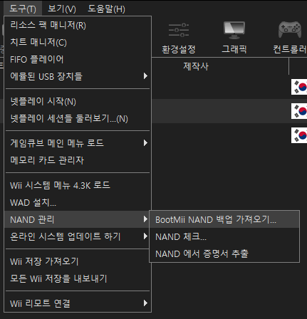

[↩️ 0. 준비](../0_preparation/)

## 들어가기에 앞서
> ⚠️ **상당히 위험한 작업입니다!**

다시 모딩을 하려고 하는거나 4.3으로 업데이트를 위한거라면 **따라할 필요가 없습니다.**\
BootMii에 접근이 가능한 한에서 소프트웨어 벽돌이 되었거나 중고에 내놓기 위해 순정으로 돌릴려고 하는거라면 진행해주세요.\
이미 벽돌인 상태라면 [wii.guide 벽돌 문서(영문)](https://wii.hacks.guide/bricks)를 먼저 확인 해주세요!

게임큐브 컨트롤러 연결이 불가한 RVL-101[^1] 기기는 진행할 수 없습니다. (현재로서?)

본 포스팅은 이미 모딩이 된 한국판 Wii 기준으로 진행됩니다.

## 준비물
- SD카드 (최소 512MB, >=1GB 권장)
- [NAND 백업본](https://wii.hacks.guide/bootmii), **다른 본체의 NAND 사용 불가**
- 인터넷 연결된 컴퓨터
- [Ohneschwanzenegger](https://raw.githubusercontent.com/modmii/modmii.github.io/master/temp/ohneschwanzenegger.zip)
- [Nand BIN Checker](https://wii.hacks.guide/assets/files/nandBinCheck.zip)
- 게임큐브 컨트롤러[^필수]

## 공백 NAND 만들기
1. Ohneschwanzenegger를 실행한다.
2. `Local Cache` 버튼을 누르고, 새로운 폴더를 만든 뒤 지정한다.

3. 좌측 상단 `Nand Dump` 툴바를 누르고, `New nand...`를 누른다.
4. `Existing Nand...` 버튼을 누르고 Wii에서 백업한 nand.bin을 지정한다.
5. `Destination` 버튼을 눌러 순정 NAND 파일을 어디에 저장할지 지정한다.

### 순정 NAND 만들기
1. 좌측 상단 `Content` 툴바를 누르고, `Format`을 누른다. 확인창이 뜨면 Yes.

2. 좌측 상단 텍스트 박스에 Wii 시스템 메뉴 버전을 입력한다. 다운그레이드가 가능하긴 하나 최신인 `4.3K` 입력.

> 
> Wii 본체 밑에 어느 지역인지 나오는데, 여기서 한국판이 맞는지 확인을 해줘야 한다! ~~다르다면 난 모른다~~\
일련 번호는 나중에 필요하니 메모.
3. 제대로 입력했다면 `Get It!` 버튼을 누른다. 시간이 좀 걸리니 커피 한잔하자.

4. 모두 완료 되었다면 Setting.txt 창이 뜰것이다, **`Code` 또는 `SerNo` 칸이 잘못된 값으로 나왔다면 수정해줘야 한다!**
> 스티커에서 일련 번호는 `LKM63201187[3]` 같이 표기되어 있는데, 이때 Code는 `LKM`이고 SerNo는 `632011873`이다. **네모칸에 있는 숫자 포함!**

5. 좌측 상단 `Content` 툴바를 누르고, `Write meta entries`를 누른뒤 `Flush`를 누른다.

## NAND 검사
1. `nandBinCheck.exe`를 Ohneschwanzenegger가 있는 폴더에 옮긴다.
2. 명령 프롬프트 또는 PowerShell을 열고, 드래그&드롭으로 명령어를 만든 뒤 실행시킨다.

3. 모든게 정상이라면 아래 이미지와 비슷한 결과가 나올 것이다. 오류가 보인다면 **절대로 사용해선 안된다.**

4. 이제 순정 NAND 파일을 SD카드에 옮기고, `nand.bin`으로 이름을 변경한다. (기존 백업본은 당연히 미리 따로 저장해야 한다)

## 복원
### 테스트? (선택)
[한국판 Wii에서 NAND 복원하는건 현재로서는 아주 위험한 행동이다.](../0_preparation/#검색)\
그래서 Dolphin 에뮬로 되긴 하는지 보려고 한다(?)

파일을 불러와서 `NAND 체크`를 하거나 `Wii 시스템 메뉴 로드`로 돌아가는지 확인해본다.

### Priiloader 제거
혹시 모를 충돌에 방지하기 위해 [Priiloader installer](https://oscwii.org/library/app/priiloader)를 홈브류에서 열고 `-` 버튼을 눌러 Priiloader를 제거한다.

### BootMii에서 복원
> **⚠️ 복원 중 전원이 꺼지거나 SD카드에 문제가 있으면 영구 복돌이 된다! 정말로 조심해야 한다.**

1. 홈브류에서 `HOME` 버튼을 누르고, `Launch BootMii`를 눌러 BootMii에 진입한다.
2. 게임큐브 컨트롤러를 연결한다. 

[^1]: 한국에서는 2014년 [뉴 슈퍼 마리오 브라더스가 포함된 검정 Wii](https://web.archive.org/web/20200227163741/https://www.nintendo.co.kr/Wii/wii/thebody.php)로 나왔다. 구별법은 새겨진 Wii 위치를 보면 될듯 하다.
[^필수]: BootMii가 IOS만 설치되어 있으면 복원 작업 전 컨트롤러로 코나미 코드를 입력해야기 때문이다.