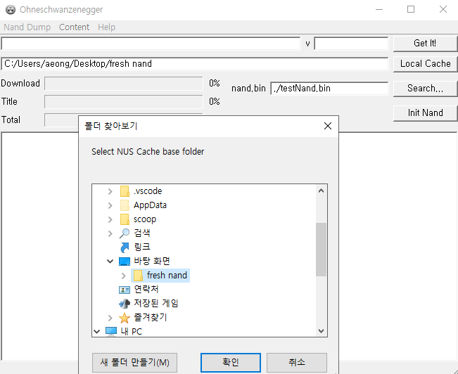
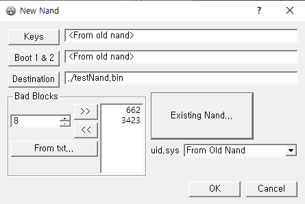
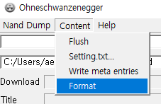

[↩️ 0. 준비](../0_preparation/)

## 들어가기에 앞서
> ⚠️ **상당히 위험한 작업입니다!**

다시 모딩을 하려고 하는거나 4.3으로 업데이트를 위한거라면 **따라할 필요가 없습니다.**

BootMii에 접근이 가능한 한에서 소프트웨어 벽돌이 되었거나 중고에 내놓기 위해 순정으로 돌릴려고 하는거라면 진행해주세요.

게임큐브 컨트롤러 연결이 불가한 RVL-101[^1] 기기는 진행할 수 없습니다. (현재로서?)

본 포스팅은 이미 모딩이 된 Wii에서 진행됩니다.

## 준비물
- SD카드 (최소 512MB, >=1GB 권장)
- [NAND 백업본](https://wii.hacks.guide/bootmii), **다른 본체의 NAND 사용 불가**
- 인터넷 연결된 컴퓨터
- [Ohneschwanzenegger](https://raw.githubusercontent.com/modmii/modmii.github.io/master/temp/ohneschwanzenegger.zip)
- [Nand BIN Checker](https://wii.hacks.guide/assets/files/nandBinCheck.zip)

## 공백 NAND 만들기
1. Ohneschwanzenegger를 실행한다.
2. `Local Cache` 버튼을 누르고, 새로운 폴더를 만든 뒤 지정한다.

3. 좌측 상단 `Nand Dump` 툴바를 누르고, `New nand...`를 누른다.
4. `Existing Nand...` 버튼을 누르고 NAND 백업본인 nand.bin을 지정한다.
5. `Destination` 버튼을 눌러 순정 NAND 파일을 어디에 저장할지 지정한다.

### 순정 NAND 만들기
1. 좌측 상단 `Content` 툴바를 누르고, `Format`을 누른다. 확인창이 뜨면 Yes.

2. 좌측 상단 텍스트 박스에 Wii 시스템 메뉴 버전을 입력한다. 다운그레이드가 가능하긴 하나 `4.3K` 입력.
> Wii 본체 밑에 어느 지역인지 나오는데, 여기서 한국판이 맞는지 확인을 해줘야 한다! **다르다면 다시 원래 지역으로 되돌려야 한다.** 일련 번호는 필요하니 메모.
3. 제대로 입력했다면 `Get It!` 버튼을 누른다. 시간이 좀 걸리니 커피 한잔하자.

[^1]: 한국에서는 2014년 [뉴 슈퍼 마리오 브라더스가 포함된 검정 Wii](https://web.archive.org/web/20200227163741/https://www.nintendo.co.kr/Wii/wii/thebody.php)로 나왔다. 구별법은 새겨진 Wii 위치를 보면 될듯 하다.